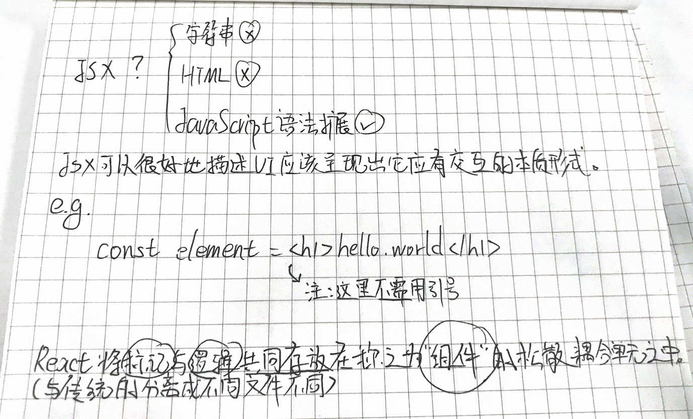
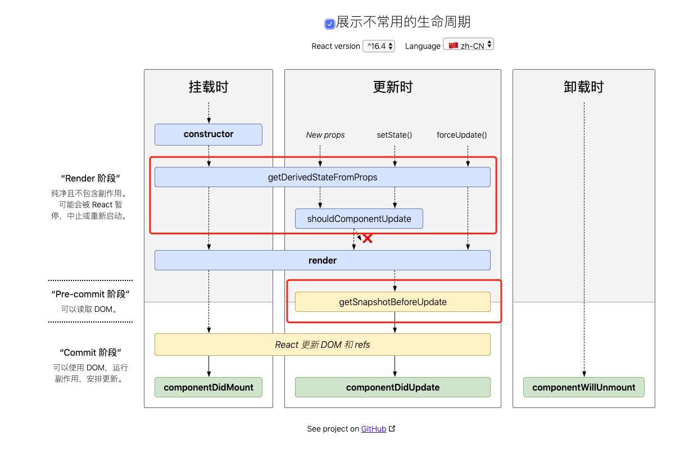

# React 官网文档学习 - 核心概念
[文档地址(v16.9.0)](https://zh-hans.reactjs.org/docs/getting-started.html)
>**说明:** 此文档为个人学习官网文档的笔记，大部分为官网的内容或是内容经过自己理解的文字，如真有人参阅此文档建议从官网学习后看看我们之间理解的出入，其中会加入我自己的理解，由此便会打乱学习顺序，不便与按步骤学习，软件也都有时效性，这篇文档之后也不会在学习结束后以版本为单位进行更新（那是另开一篇的事情）。
# 核心概念
## JSX
### 什么是JSX：

JSX 是 React 重要的一个特性，可以用于更直观友好的管理代码。（不过当初我第一次使用 J）

### JSX 中嵌入表达式
```javascript
const name = "YonDee";
const element = <h1>Hello, {name}</h1>;

ReactDOM.render(
  element,
  document.getElementById('root')
)
```
注意这里的 `{name}` 在JSX中用大括号`{}`来使用表达式。
> 在 JSX 语法中，可以在大括号内放置任何有效的 JavaScript 表达式。<br />
例如: `2+2` 一个计算表达式, `user.firstName` 访问一个对象属性, `formatName(user)` 函数调用

函数使用示例：
```javascript
function formatName(user){
  return user.firstName + ' ' + user.lastName;
}

const user = {
  firstName: 'Yon',
  lastName: 'Dee'
};

// 使用括号 '()' 来将 JSX 拆分成多行
const element = (
  <h1>
    Hello, {formatName(user)}!
  </h1>
);

ReactDOM.render(
  element,
  document.getELementById('root')
);
```

### JSX 也是一个表达式
在编译之后，JSX 表达式会被转为普通 JavaScript 函数调用，并且对其取值后得到 JavaScript 对象。

也就是说，可以在 `if` 语句和 `for` 循环的代码块中使用 JSX，将 JSX 赋值给变量，把 JSX 当作参数传入，以及从函数中返回 JSX。
```javascript
// 之前 tic-tac-toe 循环渲染方块
render() {
  let element = [];
  for (let index = 0; index < 3; index++) {
    const i = (index + 1) * 3
    element.push(
      <div className="board-row" key={i}>
        {this.renderSquare(i - 3)}
        {this.renderSquare(i - 2)}
        {this.renderSquare(i - 1)}
      </div>
    );
  }
  return (
    <div>
      { element }
    </div>
  );
}
```
这里的 JSX 用`push`向`element`推入，数组`element`最终在另一个 JSX 中使用。

### JSX 特定属性
```javascript
// 可以通过引号，来将属性值指定为字符串字面量
const element = <div tabIndex="0"></div>;
```
```javascript
// 在属性中嵌入JSX表达式，不要在打括号外面加上引号。引号——对于字符串值，大括号——对于表达式
const element = </img>;
```
> 因为 JSX 语法上更接近 JavaScript 而不是 HTML，所以 React DOM 使用 camelCase (小驼峰命名)来定义属性的名称，而不使用 HTML 属性名称的命名规定。
<br />
JSX 中的 class 变成了 className, 而 tabIndex 变为 tabIndex

### 使用 JSX 指定子元素
```javascript
// 加入一个标签里没有内容，可以使用 `/>`，就像 XML 语法一样
const element = ;

// JSX 标签里能够包含很多子元素
const element = (
  <div>
    <h1>Hello!</h1>
    <h1>Good to see you here.</h1>
  </div>
)
```

### JSX 防止注入攻击
```javascript
// 可以安全的在JSX中插入用户输入内容
const title = response.potentiallMaliciousInput;
const element = <h1>{title}</h1>;
```
> React DOM 在渲染所有输入内容之前，默认会进行转义。可以有效防止XSS攻击。

### JSX 表示对象
Babel 会把 JSX 转译成一个名为 `React.createElement()` 函数调用。
```javascript
const element = (
  <h1 className="greeting">
    Hello, world!
  </h1>
)

// 等效于下面
const element = React.createElement(
  'h1',
  {className: 'greeting'},
  'Hello, world!'
);
```
`React.createElement()` 会预先执行一些检查。创建了如下这样的对象：
```javascript
// 注：这是个简化过的结构
const element = {
  type: 'h1',
  props: {
    className: 'greeting',
    children: 'Hello, world!'
  }
}
```
这些对象被称为 “React 元素”。它们描述了你希望在屏幕上看到的内容。React 通过读取这些对象，然后使用它们来构建 DOM 以及保持随时更新。


# 元素渲染
## 概念
```
元素是构成 React 应用的最小砖块
元素描述了你在屏幕上想看到的内容。
```
> 组件是由元素构成的，两个并不是一个概念。

## 将一个元素渲染为 DOM
假设一个根节点
```html
<div id="root"></div>
```
```javascript
// 先创建需要添加到根节点中的 React 元素
const element = <h1>Hello world!</h1>;
// 使用 ReactDOM.render() 方法传入
ReactDOM.render(element, document.getElementById('root'));
```

> 仅使用 React 构建的应用通常只有单一的根 DOM 节点。如果你在将 React 集成进一个已有应用，那么你可以在应用中包含任意多的独立根 DOM 节点。

## 更新已渲染的元素
React 元素是不可变对象，创建了就无法更改它的子元素或者属性。
> 官网这个形容特别好：一个元素就像电影的单帧：它代表了某个特定时刻的 UI。

根据现有的知识(组件无状态)，想要更新UI的方式，是创建一个新的元素，传入`ReactDOM.render()`，也就是替换掉之前渲染的元素。

> 一般一个应用只调用一次 `ReactDOM.render()`，所以需要将代码封装到有状态组件中。

## React 只更新它需要更新的部分
React DOM 会将元素和它的子元素与它们之前的状态进行比较，只进行必要的更新，来使 DOM 达到预期的状态。

# 组件 & Props
组件允许你将 UI 拆分为独立可复用的代码片段，并对每个片段进行独立构思。

## 概念
组件，从概念上类似于 JavaScript 函数。它接受任意的入参（props）,并返回用于描述页面展示内容的 React 元素。

## 函数组件与 class 组件
定义组件最简单的方式就是编写 JavaScript 函数：
```javascript
funciton Welcome(props){
  return <h1>Hello, {props.name}</h1>;
}
```
该函数是一个有效的 React 组件，因为它接收唯一带有数据的 “props”（代表属性）对象与并返回一个 React 元素。这类组件被称为“函数组件”，因为它本质上就是 JavaScript 函数。(因为这个结构和数据交互逻辑达到了组件所需的程度)

还有一种比较常见的方式（ES6 class）:
```javascript
class Welcome extends React.Component {
  render() {
    // 注意这里相对于函数组件的区别，props对象由this访问
    return <h1>Hello, {this.props.name}</h1>;
  }
}
```
组件等效于上面的函数组件

## 渲染组件
React 元素除了 HTML 标签还可以是用户自定义的组件：
```javascript
// 调用用户自定义声明好的 Welcome 组件
const element = <Welcome  name="Sara" />;
```
当 React 元素为用户自定义组件时，它会将 JSX 所接收的属性（attributes）转换为单个对象传递给组件，这个对象被称之为 “props”。（比如上面代码中的`name='Sara'`）

此时调用`ReactDOM.render()`将会渲染出组件中的 React 元素，按照传入的 props 显示相应的内容。

发生的步骤如下：
1. 调用 `ReactDOM.render()` 函数，并传入`<Welcome name="Sara" />`(`element`变量) 作为参数。
2. React 调用 `Welcome` 组件，并将 `{name: 'Sara'}`(组件标签中的`name='Sara'`属性转的单个对象) 作为 props 传入。
3. `Welcome` 组件将 `<h1>Hello, Sara</h1>` 元素作为返回值。
4. `ReactDOM`将`DOM`高效地更新为`<h1>Hello, Sara</h1>`(返回的 HTML 元素和 React 元素差不多，除了我们自定义的内容由 props 决定了。)

> 注意： **组件名称必须以大写开头**<br />
React 将以小写字母开头的组件,视为原生 DOM 标签。<br />
例如，`<div />` 代表 HTML 的 div 标签，而 `<Welcome />` 则代表一个组件，并且需在作用域内使用 Welcome。

## 组合组件
组件可以在其输出中引用其他组件。这就可以让我们用同一组件来抽象出任意层次的细节。（在组件中组合别的组件来渲染出所预期的 DOM） 。按钮，表单，对话框，甚至整个屏幕的内容：在 React 应用程序中，这些通常都会以组件的形式表示。（组件尽可能的简单，通过组合使用组件来尽可能的解耦）

```javascript
function Welcome(props) {
  return <h1>Hello, {props.name}</h1>;
}

function App() {
  return (
    <div>
      // 这里使用了三个上面定义的 Welcome 组件,组成了新的 App组件
      <Welcome name="Sara" />
      <Welcome name="Cahal" />
      <Welcome name="Edite" />
    </div>
  );
}

ReactDOM.render(
  <App />,  // 这个组件里包含了三个 Welcome 组件
  document.getElementById('root')
);
```

## 提取(拆分)组件
将组件拆分为更小的组件，提取组件可能是一件繁重的工作，但是，在大型应用中，构建可复用组件库是完全值得的。(拆分的越细复用程度越高，唯一缺点就是组件数量多，需要管理好维护好拆分的组件。)

## Props 的只读属性
组件无论是使用函数声明还是通过 class 声明，都决不能修改自身的 props。
> 所有 React 组件都必须像纯函数（相同的入参返回相同的结果，而不是在函数内部改变参数内容）一样保护它们的 props 不被更改。

# State & 生命周期
> 个人的理解中，生命周期就是一个组件的状态，状态改变过程中可能会触发处理函数，比如Vue的`created`,`mounted`, `destroyed`...等等，也有组件状态发生变化时触发的生命周期函数`updated`...等等，这些函数也叫生命周期钩子，在不同的阶段不同的组件状态时添加自己的处理代码。

之前通过`ReactDOM.render()`(重新渲染)来修改我们想要渲染的元素。现在可以通过给组件添加`state`来实现组件的自我更新，`state` 与 `props` 类似，但是 `state` 是私有的，并且完全受控于当前组件。

官网有一个Clock组件示例：
```javascript
// 函数组件
function Clock(props) {
  return (
    <div>
      <h1>Hello, world!</h1>
      <h2>It is {props.date.toLocaleTimeString()}.</h2>
    </div>
  );
}

function tick() {
  ReactDOM.render(
    <Clock date={new Date()} />,
    document.getElementById('root')
  );
}

setInterval(tick, 1000);
```
函数式方法渲染实现一个计时时钟

```javascript
// 使用state和生命周期方法实现组件自我管理，使用ES6 class，将函数组件转换成 class 组件
class Clock extends React.Component {
  constructor(props) {
    super(props);
    this.state = {date: new Date()};
  }

  // 组件挂载完毕(mount)时设置计时器
  componentDidMount() {
    this.timerID = setInterval(
      () => this.tick(),
      1000
    );
  }

  // 组件卸载(unmount)时清除计时器
  componentWillUnmount() {
    clearInterval(this.timerID);
  }

  // mount 设置的计时器中调用的方法
  tick() {
    this.setState({
      date: new Date()
    });
  }

  render() {
    return (
      <div>
        <h1>Hello, world!</h1>
        <h2>It is {this.state.date.toLocaleTimeString()}.</h2>
      </div>
    );
  }
}

ReactDOM.render(
  <Clock />,
  document.getElementById('root')
);
```
这里需要注意的是我们需要继承`React.Component`来实现 **class组件**，组件内部的参数由原先函数组件中的`props`的入参变成了`this.props`属性，**class组件** 中需要添加一个 `render()` 方法，这个方法用来确定展示什么。

## 正确的使用 State
### 不要直接修改 State
```javascript
// Wrong
this.state.comment = 'Hello';
```
正确如下：
```javascript
// Correct
this.setState({comment: 'Hello'});
```
构造函数(constructor)是唯一可以给 `this.state` 赋值的地方。

### State 的更新可能是异步的
`this.props` 和 `this.state` 可能会异步更新，不能依赖其来更新状态。

错误的用法
```javascript
this.setState({
  cunter: this.state.counter + this.props.increment
})
```
正确的用法
```javascript
// 将 setState() 接受一个函数而不是对象，函数用上 state 作为第一个参数，将此次更新被应用时的 props 作为第二个参数：
this.setState(state, props) => ({
  cunter: state.counter + props.increment
})
```
> 这里的`setState()`和VUE的`data()`有什么类似的地方么？

## State 的更新会被合并
当你调用 `setState()`的时候，React 会把你提供的对象合并到当前的 state。
> 这段没看明白，稍后在深入研究

## 数据是向下流动的
(俗称数据是下流的)又叫单向数据流，这个单向是从上（父级）到下（子级）
> **官方的定义说明**：<br />通常会被叫做“自上而下”或是“单向”的数据流。任何的 state 总是所属于特定的组件，而且从该 state 派生的任何数据或 UI 只能影响树中“低于”它们的组件。<br />
如果你把一个以组件构成的树想象成一个 props 的数据瀑布的话，那么每一个组件的 state 就像是在任意一点上给瀑布增加额外的水源，但是它只能向下流动。

不管是父组件还是子组件都不知道某个组件是有状态还是无状态的，也不关心是函数组件还是class组件。
`state` 是局部的，封装在组件中的，其他组件都无法访问，除了组件本身。

但是`state`并不是自闭的，它可以作为 `props` (组件设定的可接受的参数) 向下传递到它的子组件中：
```javascript
// 原生元素中
<h2>It is {this.state.date.toLocaleTimeString()}.</h2>

// 自定义组件中, 假设和上面一样都在一个组件中使用了，这个组件就是它们的父组件
<FormattedDate date={this.state.date} />
// 这个自定义组件是这么定义的
funciton FormattedDate(props){
  return <h2>It is {props.data.toLocaleTimeString()}.</h2>
}
```
> 每个子组件都是相互独立的，哪怕在一个组件中重复使用这个子组件，这个子组件也是相互独立的。根据需要选择有状态的组件和无状态的组件。

## 生命周期详细理解
首先官方给了一个生命周期图表：http://projects.wojtekmaj.pl/react-lifecycle-methods-diagram/

图示如下：

> **红框为不常用的生命周期**，生命周期图以 React 版本为主，如今我学习到的版本已经阉割了一些生命周期，例如：`UNSAFE_componentWillMount()`(在挂载`render()`之前被调用，已被 `constructor()` 代替了初始化的使命)

相比VUE粒度更细的生命周期，确实要简单很多

### React 的生命周期流程
一个组件的生命周期：
```
挂载(mount) -> 更新(update) -> 卸载(unmount)
```
挂载阶段：
- constructor()
- static getDerivedStateFromProps()
- render()
- componentDidMount()
> (阶段都是自上而下)

更新阶段：
> **更新条件** 当组件的`props`或`state`发生变化时会触发更新

组件更新的生命周期调用顺序如下:
- static getDerivedStateFromProps()
- shouldComponentUpdate()
- render()
- getSnapshotBeforeUpdate()
- componentDidUpdate()

卸载阶段：
- componentWillUnmount()
> 卸载完成后组件会从DOM中移除，移除时执行上面的生命周期函数

更具体的参阅 [React.Component](https://zh-hans.reactjs.org/docs/react-component.html)

## 事件处理
概念：React 元素的事件处理和 DOM 元素的很相似，但是有一点语法上的不同：
- React 事件的命名采用小驼峰式（camelCase），而不是纯小写。
- 使用 JSX 语法时你需要传入一个函数作为事件处理函数，而不是一个字符串。

对比下面的代码示例更好理解：
- 在一般的 HTML 中，给元素添加事件处理方法
```html
<button onclick="activateLasers()">
  Activate Lasers
</button>
// 改成 jsx 形式很简单，将
```
React 中的事件处理函数绑定只需要将上面的`onclick="activateLasers()"`改为`onClick={activateLasers()}`,注意这里的`onclick`和后者(react)的`onClick`是不同的，两者绑定的都是同一个事件。

在一般的html中，例如`<a>`标签的行为可以使用`href="return false"`来取消默认行为，而在react中则必须要在事件绑定的函数中**显示**使用`event.preventDefault()`来取消默认行为。

例如：
- 一个取消了a标签默认行为的组件
```js
function ActionLink() {
  function handleClick(e) {
    e.preventDefault();
    console.log('The link was clicked.');
  }

  return (
    <a href="#" onClick={handleClick}>
      Click me
    </a>
  );
}
```
> 这里的 `e` 是一个合成事件

在使用 ES6 时，应该将事件处理函数声明为class中的方法。
```js
class Toggle extends React.Component {
  constructor(props) {
    super(props);
    this.state = {isToggleOn: true};

    // 为了在回调中使用 `this`，这个绑定是必不可少的，不然this是undefined
    this.handleClick = this.handleClick.bind(this);
  }

  // 声明后在render返回的jsx对象中绑定了这个方法
  handleClick() {
    this.setState(state => ({
      isToggleOn: !state.isToggleOn
    }));
  }

  render() {
    return (
      <button onClick={this.handleClick}>
        {this.state.isToggleOn ? 'ON' : 'OFF'}
      </button>
    );
  }
}

ReactDOM.render(
  <Toggle />,
  document.getElementById('root')
);
```
> 注意在 JavaScript 中的 class 的方法，因为js的函数工作原理，默认不会绑定 this。通常情况下，如果你没有在方法后面添加 `()`，例如 `onClick={this.handleClick}`，你应该为这个方法绑定 `this`。
> 一定要注意this带来的影响，在文档种被反复提到并且提供了几种解决方法，上文摘自官网的代码便是其中一种方案。

## 条件渲染
在vue中用过也就不再摘抄官网的概念的，一言以蔽之：用（组件的）状态控制组件的渲染。

提到条件，联想到JavaScript ，第一个想到的自然是`if`

所以在 react 中 条件渲染是这样的：
```js
function Greeting(props) {
  const isLoggedIn = props.isLoggedIn;
  if (isLoggedIn) {
    return <UserGreeting />;
  }
  return <GuestGreeting />;
}

ReactDOM.render(
  // Try changing to isLoggedIn={true}:
  <Greeting isLoggedIn={false} />,
  document.getElementById('root')
);
```
上面的组件会根据`isLoggedIn`中的值来选择如何渲染组件
> 这里又要开始联想vue了，vue是在元素中使用了`v-if`指令来进行条件渲染的，而reactjs的用法更加倾向于原生js的用法，这里是直接在jsx的元素中放入判断表达式。

### 元素变量
```js
class LoginControl extends React.Component {
  constructor(props) {
    super(props);
    this.handleLoginClick = this.handleLoginClick.bind(this);
    this.handleLogoutClick = this.handleLogoutClick.bind(this);
    this.state = {isLoggedIn: false};
  }

  handleLoginClick() {
    this.setState({isLoggedIn: true});
  }

  handleLogoutClick() {
    this.setState({isLoggedIn: false});
  }

  render() {
    const isLoggedIn = this.state.isLoggedIn;
    let button;

  // 条件渲染，并且使用功变量来存储元素，因为JSX也算是表达式，故此用法
    if (isLoggedIn) {
      button = <LogoutButton onClick={this.handleLogoutClick} />;
    } else {
      button = <LoginButton onClick={this.handleLoginClick} />;
    }

    return (
      <div>
        <Greeting isLoggedIn={isLoggedIn} />
        {button}
      </div>
    );
  }
}

ReactDOM.render(
  <LoginControl />,
  document.getElementById('root')
);
```

### 与（&&）运算符
一般用在js中的表达式在JSX中同样可行
```js
function Mailbox(props) {
  const unreadMessages = props.unreadMessages;
  // 里面的 && 就代替了 if，在没有else条件下这样更加简洁
  return (
    <div>
      <h1>Hello!</h1>
      {unreadMessages.length > 0 &&
        <h2>
          You have {unreadMessages.length} unread messages.
        </h2>
      }
    </div>
  );
}

const messages = ['React', 'Re: React', 'Re:Re: React'];
ReactDOM.render(
  <Mailbox unreadMessages={messages} />,
  document.getElementById('root')
);
```
> 记住在jsx中运行表达式，需要写在大括号`{}`中
### 三目运算符 `condition ? true : false`
```js
render() {
  const isLoggedIn = this.state.isLoggedIn;
  return (
    <div>
      {isLoggedIn ? (
        <LogoutButton onClick={this.handleLogoutClick} />
      ) : (
        <LoginButton onClick={this.handleLoginClick} />
      )}
    </div>
  );
}
```
一个复杂的三目运算，不过看起来不是很直观

### 阻止组件渲染
简单来说就是组件根据状态返回值，如果状态表示为不需要渲染，那么`render`方法直接返回`null`，组件将不会被渲染（即使已经被别的组件渲染）。

```js
function WarningBanner(props) {
  // 如果不需要渲染则组件返回一个null
  if (!props.warn) {
    return null;
  }

  return (
    <div className="warning">
      Warning!
    </div>
  );
}

class Page extends React.Component {
  constructor(props) {
    super(props);
    this.state = {showWarning: true};
    this.handleToggleClick = this.handleToggleClick.bind(this);
  }

  handleToggleClick() {
    this.setState(state => ({
      showWarning: !state.showWarning
    }));
  }

  render() {
    // 下面 WarningBanner 的条件决定了组件是否被渲染
    return (
      <div>
        <WarningBanner warn={this.state.showWarning} />
        <button onClick={this.handleToggleClick}>
          {this.state.showWarning ? 'Hide' : 'Show'}
        </button>
      </div>
    );
  }
}

ReactDOM.render(
  <Page />,
  document.getElementById('root')
);
```

> 在组件的render方法中返回null并不会影响组件的生命周期。