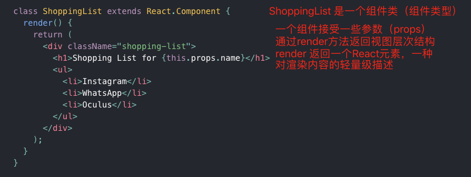
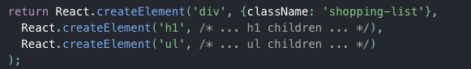
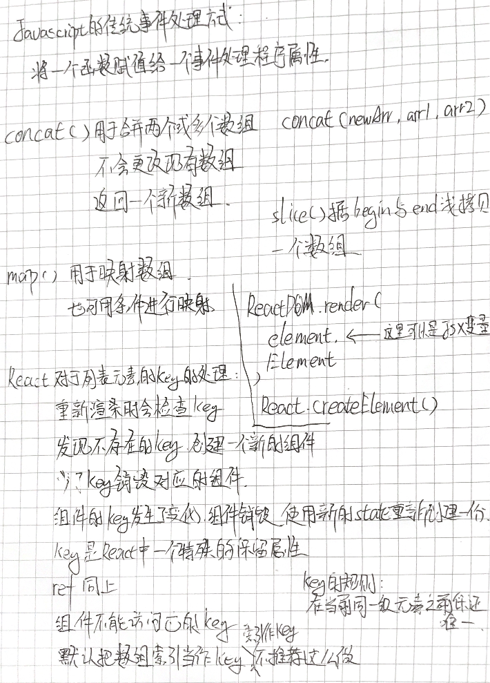

# React 官网教程学习笔记
版本：v16.9.0
环境：NodeJS(v12.4.0)

## 初始化项目
```javascript
npx create-react-app my-app
```

这时候需要删除src下所有的文件（不包含目录本身）

执行：
```shell
rm -rf my-app/src/*
```

教程里的步骤方案：
```shell
cd my-app
cd src
# mac
rm -f *
# windows
del *
# 回到项目文件夹
cd ..
```

## 创建项目
index.js:
```javascript
import React from 'react';
import ReactDOM from 'react-dom';
import './index.css';

class Square extends React.Component {
  render() {
    return (
      <button className="square">
        {/* TODO */}
      </button>
    );
  }
}

class Board extends React.Component {
  renderSquare(i) {
    return <Square />;
  }

  render() {
    const status = 'Next player: X';

    return (
      <div>
        <div className="status">{status}</div>
        <div className="board-row">
          {this.renderSquare(0)}
          {this.renderSquare(1)}
          {this.renderSquare(2)}
        </div>
        <div className="board-row">
          {this.renderSquare(3)}
          {this.renderSquare(4)}
          {this.renderSquare(5)}
        </div>
        <div className="board-row">
          {this.renderSquare(6)}
          {this.renderSquare(7)}
          {this.renderSquare(8)}
        </div>
      </div>
    );
  }
}

class Game extends React.Component {
  render() {
    return (
      <div className="game">
        <div className="game-board">
          <Board />
        </div>
        <div className="game-info">
          <div>{/* status */}</div>
          <ol>{/* TODO */}</ol>
        </div>
      </div>
    );
  }
}

// ========================================

ReactDOM.render(
  <Game />,
  document.getElementById('root')
);

```

index.css:
```javascript
body {
  font: 14px "Century Gothic", Futura, sans-serif;
  margin: 20px;
}

ol, ul {
  padding-left: 30px;
}

.board-row:after {
  clear: both;
  content: "";
  display: table;
}

.status {
  margin-bottom: 10px;
}

.square {
  background: #fff;
  border: 1px solid #999;
  float: left;
  font-size: 24px;
  font-weight: bold;
  line-height: 34px;
  height: 34px;
  margin-right: -1px;
  margin-top: -1px;
  padding: 0;
  text-align: center;
  width: 34px;
}

.square:focus {
  outline: none;
}

.kbd-navigation .square:focus {
  background: #ddd;
}

.game {
  display: flex;
  flex-direction: row;
}

.game-info {
  margin-left: 20px;
}
```

创建完成后

执行：
```shell
npm start
# Local: http://localhost:3000/
```

## 概览
### React 是什么？
React 是一个声明式，高效且灵活的用于构建用户界面的 JavaScript 库。使用 React 可以将一些简短、独立的代码片段组合成复杂的 UI 界面，这些代码片段被称作“组件”。


使用了 JSX 的一个示例
上面的示例代码中的`<div />`会被编译成 `React.createElement('div')`

> 在 JSX 中你可以任意使用 JavaScript 表达式，只需要用一个大括号`{}`把表达式括起来。每一个 React 元素事实上都是一个 JavaScript 对象，你可以在你的程序中把它当保存在变量中或者作为参数传递。
也可以在React中使用自己的自定义React组件，比如在别的组件中使用刚刚示例中的组件`<ShoppingList />`，这样可以用来构建复杂的UI界面。

> React 监听方法命名规范，代表事件的监听命名为：`on[Event]`，将处理事件的监听方法命名为：`handle[Event]`。

## 为什么不可变性在React中非常重要
（文档中的内容，基本是抄一遍加深印象）
一般来说，有两种改变数据的方式。第一种方式是直接修改变量的值，第二种方式是使用新的一份数据替换旧数据。

### 直接修改数据
```javascript
var player = { score: 1, name: 'Jeff' };
player.score = 2;
// player 修改后的值为 {score: 2, name: 'Jeff'}
```

### 新数据替换旧数据
```javascript
var player = { score: 1, name: 'Jeff' };
var newPlayer = Object.assign({}, player, { score: 2});
// player 的值没有改变，但是 newPlayer 的值是 {score: 2, name: 'Jeff'}

// 使用对象展开语法(Spread syntax)，就可以写成:
// var newPlayer = {...player, score: 2};
```
> Object.assign() 拼接一个对象。

不直接修改（或改变底层数据）这种方式和前一种方式的结果是一样的，这种方式有以下几点好处：
- 简化复杂的功能（不可变性使得复杂的特性更容易实现。）
- 追踪数据的改变（如果直接修改数据，那么就很难跟踪到数据的改变，减少因为比较而发生的遍历的性能消耗。）
- 确定在 React 中何时重新渲染（调整渲染策略，React的性能优化相关。）


学习笔记：
