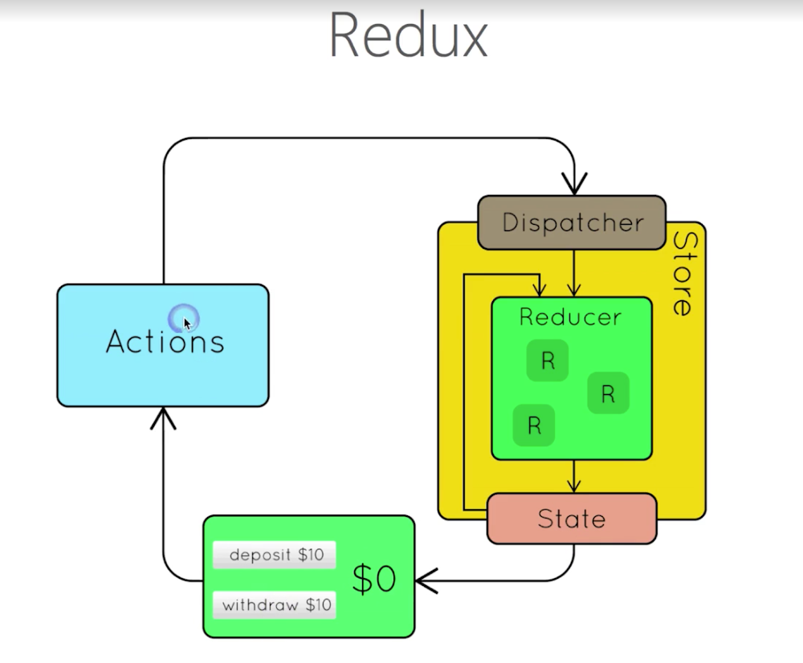
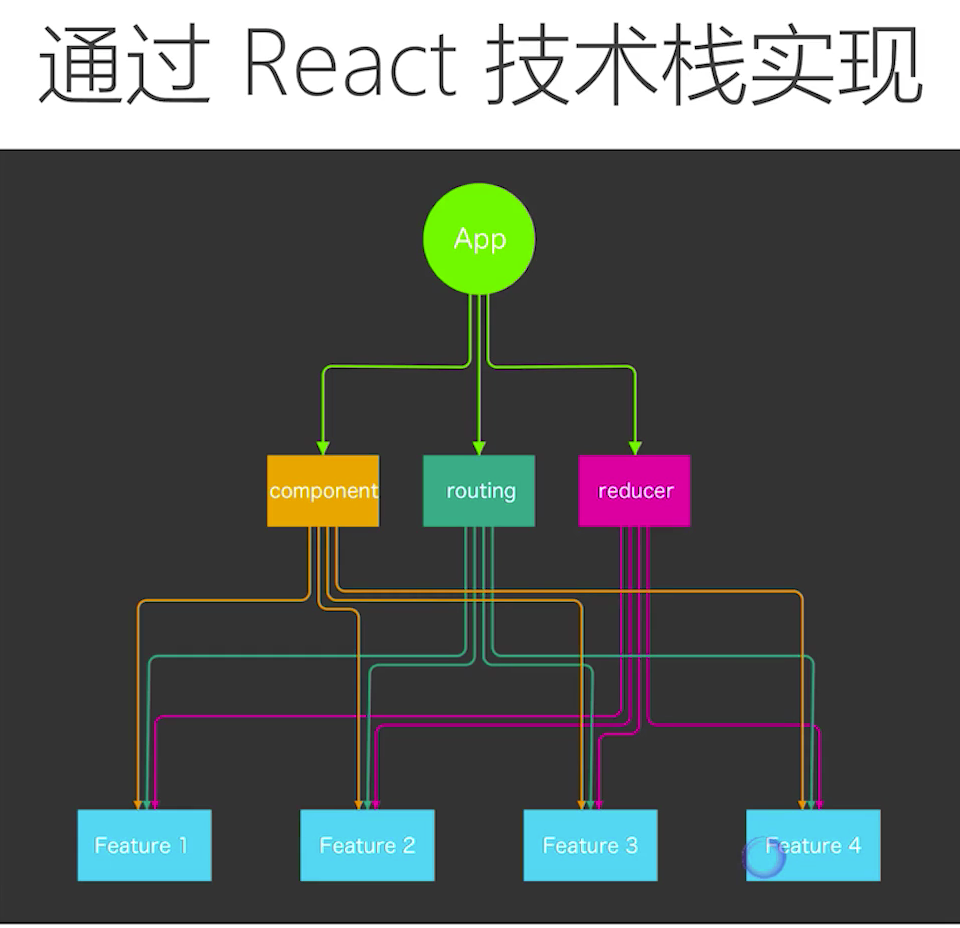
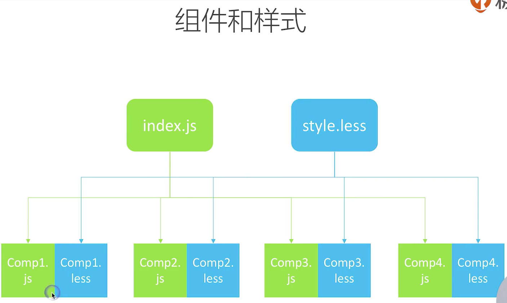
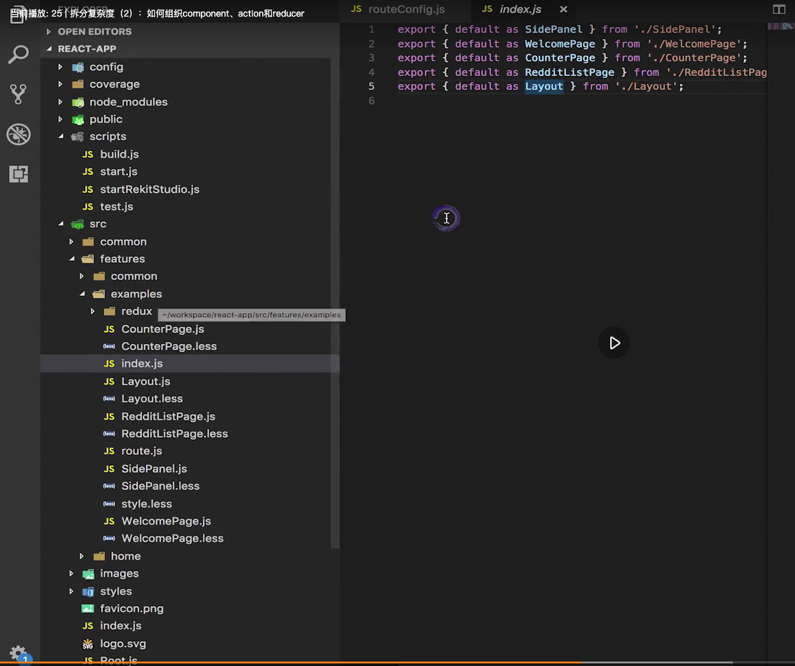
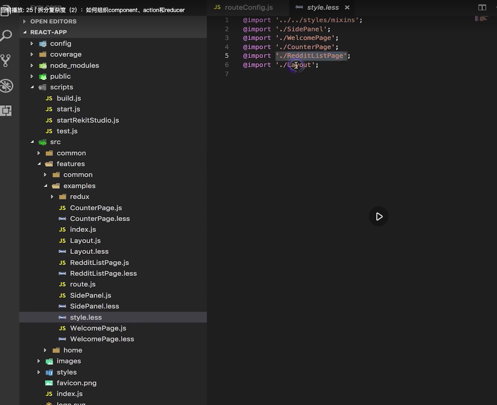
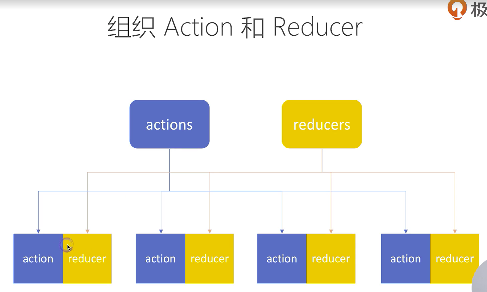
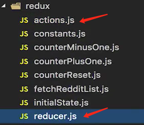
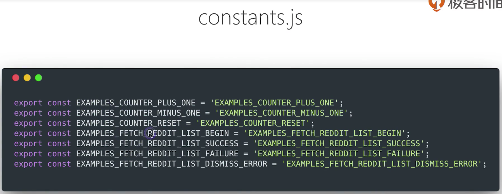

# 【极客时间】React实战进阶45讲

地址：[极客时间](https://time.geekbang.org/course/intro/100)  
课程源码地址：[codesandbox](https://codesandbox.io/s/6n20nrzlxz)
相关链接：
- [Redux 官方文档（中文）](https://cn.redux.js.org/)

- [【极客时间】React实战进阶45讲](#%e6%9e%81%e5%ae%a2%e6%97%b6%e9%97%b4react%e5%ae%9e%e6%88%98%e8%bf%9b%e9%98%b645%e8%ae%b2)
  - [初步理解 React 组件](#%e5%88%9d%e6%ad%a5%e7%90%86%e8%a7%a3-react-%e7%bb%84%e4%bb%b6)
    - [以组件化的方式思考UI的构建](#%e4%bb%a5%e7%bb%84%e4%bb%b6%e5%8c%96%e7%9a%84%e6%96%b9%e5%bc%8f%e6%80%9d%e8%80%83ui%e7%9a%84%e6%9e%84%e5%bb%ba)
    - [什么是React组件](#%e4%bb%80%e4%b9%88%e6%98%afreact%e7%bb%84%e4%bb%b6)
    - [React组件的类型](#react%e7%bb%84%e4%bb%b6%e7%9a%84%e7%b1%bb%e5%9e%8b)
    - [React 组件的创建原则](#react-%e7%bb%84%e4%bb%b6%e7%9a%84%e5%88%9b%e5%bb%ba%e5%8e%9f%e5%88%99)
  - [什么是 JSX](#%e4%bb%80%e4%b9%88%e6%98%af-jsx)
  - [声明周期和使用场景](#%e5%a3%b0%e6%98%8e%e5%91%a8%e6%9c%9f%e5%92%8c%e4%bd%bf%e7%94%a8%e5%9c%ba%e6%99%af)
    - [constructor](#constructor)
    - [getDerivedStateFromProps*(16.3 新引入)](#getderivedstatefromprops163-%e6%96%b0%e5%bc%95%e5%85%a5)
    - [componentDidMount](#componentdidmount)
    - [componentWillUnmount](#componentwillunmount)
    - [getSnapshotBeforeUpdate](#getsnapshotbeforeupdate)
    - [componentDidUpdate](#componentdidupdate)
    - [shouldComponentUpdate](#shouldcomponentupdate)
  - [理解 Virtual DOM 及 Key 属性的作用](#%e7%90%86%e8%a7%a3-virtual-dom-%e5%8f%8a-key-%e5%b1%9e%e6%80%a7%e7%9a%84%e4%bd%9c%e7%94%a8)
    - [虚拟 DOM 的两个假设](#%e8%99%9a%e6%8b%9f-dom-%e7%9a%84%e4%b8%a4%e4%b8%aa%e5%81%87%e8%ae%be)
  - [组件复用的另外两种形式：高阶组件（HOC）和函数（function）作为子组件](#%e7%bb%84%e4%bb%b6%e5%a4%8d%e7%94%a8%e7%9a%84%e5%8f%a6%e5%a4%96%e4%b8%a4%e7%a7%8d%e5%bd%a2%e5%bc%8f%e9%ab%98%e9%98%b6%e7%bb%84%e4%bb%b6hoc%e5%92%8c%e5%87%bd%e6%95%b0function%e4%bd%9c%e4%b8%ba%e5%ad%90%e7%bb%84%e4%bb%b6)
    - [高阶组件](#%e9%ab%98%e9%98%b6%e7%bb%84%e4%bb%b6)
    - [函数作为子组件](#%e5%87%bd%e6%95%b0%e4%bd%9c%e4%b8%ba%e5%ad%90%e7%bb%84%e4%bb%b6)
  - [理解新的Context API (React 16.3)](#%e7%90%86%e8%a7%a3%e6%96%b0%e7%9a%84context-api-react-163)
  - [使用脚手架工具创建 React App](#%e4%bd%bf%e7%94%a8%e8%84%9a%e6%89%8b%e6%9e%b6%e5%b7%a5%e5%85%b7%e5%88%9b%e5%bb%ba-react-app)
    - [为什么要使用脚手架工具](#%e4%b8%ba%e4%bb%80%e4%b9%88%e8%a6%81%e4%bd%bf%e7%94%a8%e8%84%9a%e6%89%8b%e6%9e%b6%e5%b7%a5%e5%85%b7)
  - [打包和部署](#%e6%89%93%e5%8c%85%e5%92%8c%e9%83%a8%e7%bd%b2)
    - [为什么需要打包？](#%e4%b8%ba%e4%bb%80%e4%b9%88%e9%9c%80%e8%a6%81%e6%89%93%e5%8c%85)
    - [打包注意事项](#%e6%89%93%e5%8c%85%e6%b3%a8%e6%84%8f%e4%ba%8b%e9%a1%b9)
  - [Redux 状态管理框架](#redux-%e7%8a%b6%e6%80%81%e7%ae%a1%e7%90%86%e6%a1%86%e6%9e%b6)
  - [Redux 特性](#redux-%e7%89%b9%e6%80%a7)
    - [Single Source of Truth](#single-source-of-truth)
    - [可预测性](#%e5%8f%af%e9%a2%84%e6%b5%8b%e6%80%a7)
    - [纯函数去更新 Store](#%e7%ba%af%e5%87%bd%e6%95%b0%e5%8e%bb%e6%9b%b4%e6%96%b0-store)
  - [理解 Store](#%e7%90%86%e8%a7%a3-store)
  - [理解 action](#%e7%90%86%e8%a7%a3-action)
  - [理解 reducer](#%e7%90%86%e8%a7%a3-reducer)
  - [理解 combineReducers](#%e7%90%86%e8%a7%a3-combinereducers)
  - [理解 bindActionCreators](#%e7%90%86%e8%a7%a3-bindactioncreators)
  - [在 React 中使用 Redux](#%e5%9c%a8-react-%e4%b8%ad%e4%bd%bf%e7%94%a8-redux)
    - [connect 的工作原理：高阶组件（设计模式）](#connect-%e7%9a%84%e5%b7%a5%e4%bd%9c%e5%8e%9f%e7%90%86%e9%ab%98%e9%98%b6%e7%bb%84%e4%bb%b6%e8%ae%be%e8%ae%a1%e6%a8%a1%e5%bc%8f)
  - [理解异步 Action，Redux 中间件](#%e7%90%86%e8%a7%a3%e5%bc%82%e6%ad%a5-actionredux-%e4%b8%ad%e9%97%b4%e4%bb%b6)
    - [Redux 中间件（Middleware）](#redux-%e4%b8%ad%e9%97%b4%e4%bb%b6middleware)
    - [小结](#%e5%b0%8f%e7%bb%93)
  - [如何组织 Redux Action 的问题](#%e5%a6%82%e4%bd%95%e7%bb%84%e7%bb%87-redux-action-%e7%9a%84%e9%97%ae%e9%a2%98)
  - [理解不可变数据( immutable data )](#%e7%90%86%e8%a7%a3%e4%b8%8d%e5%8f%af%e5%8f%98%e6%95%b0%e6%8d%ae-immutable-data)
    - [为何需要不可变数据](#%e4%b8%ba%e4%bd%95%e9%9c%80%e8%a6%81%e4%b8%8d%e5%8f%af%e5%8f%98%e6%95%b0%e6%8d%ae)
    - [如何操作不可变数据](#%e5%a6%82%e4%bd%95%e6%93%8d%e4%bd%9c%e4%b8%8d%e5%8f%af%e5%8f%98%e6%95%b0%e6%8d%ae)
  - [路由不只是页面切换，更是代码组织方式](#%e8%b7%af%e7%94%b1%e4%b8%8d%e5%8f%aa%e6%98%af%e9%a1%b5%e9%9d%a2%e5%88%87%e6%8d%a2%e6%9b%b4%e6%98%af%e4%bb%a3%e7%a0%81%e7%bb%84%e7%bb%87%e6%96%b9%e5%bc%8f)
    - [React Router 特性](#react-router-%e7%89%b9%e6%80%a7)
    - [三种路由实现方式](#%e4%b8%89%e7%a7%8d%e8%b7%af%e7%94%b1%e5%ae%9e%e7%8e%b0%e6%96%b9%e5%bc%8f)
    - [基于路由配置进行资源组织](#%e5%9f%ba%e4%ba%8e%e8%b7%af%e7%94%b1%e9%85%8d%e7%bd%ae%e8%bf%9b%e8%a1%8c%e8%b5%84%e6%ba%90%e7%bb%84%e7%bb%87)
    - [React Router API](#react-router-api)
  - [参数定义，嵌套路由的使用场景](#%e5%8f%82%e6%95%b0%e5%ae%9a%e4%b9%89%e5%b5%8c%e5%a5%97%e8%b7%af%e7%94%b1%e7%9a%84%e4%bd%bf%e7%94%a8%e5%9c%ba%e6%99%af)
  - [UI 组件库对比和介绍：Ant Design / Material UI / Semantic UI](#ui-%e7%bb%84%e4%bb%b6%e5%ba%93%e5%af%b9%e6%af%94%e5%92%8c%e4%bb%8b%e7%bb%8dant-design--material-ui--semantic-ui)
  - [Next.js 创建 React 同构应用](#nextjs-%e5%88%9b%e5%bb%ba-react-%e5%90%8c%e6%9e%84%e5%ba%94%e7%94%a8)
    - [什么是同构应用](#%e4%bb%80%e4%b9%88%e6%98%af%e5%90%8c%e6%9e%84%e5%ba%94%e7%94%a8)
    - [创建页面](#%e5%88%9b%e5%bb%ba%e9%a1%b5%e9%9d%a2)
    - [在页面中使用其他 React 组件](#%e5%9c%a8%e9%a1%b5%e9%9d%a2%e4%b8%ad%e4%bd%bf%e7%94%a8%e5%85%b6%e4%bb%96-react-%e7%bb%84%e4%bb%b6)
    - [使用 Link 实现同构路由](#%e4%bd%bf%e7%94%a8-link-%e5%ae%9e%e7%8e%b0%e5%90%8c%e6%9e%84%e8%b7%af%e7%94%b1)
    - [动态加载页面](#%e5%8a%a8%e6%80%81%e5%8a%a0%e8%bd%bd%e9%a1%b5%e9%9d%a2)
  - [使用 Jest \ Enzyme 等工具进行单元测试](#%e4%bd%bf%e7%94%a8-jest--enzyme-%e7%ad%89%e5%b7%a5%e5%85%b7%e8%bf%9b%e8%a1%8c%e5%8d%95%e5%85%83%e6%b5%8b%e8%af%95)
    - [单元测试涉及的工具](#%e5%8d%95%e5%85%83%e6%b5%8b%e8%af%95%e6%b6%89%e5%8f%8a%e7%9a%84%e5%b7%a5%e5%85%b7)
  - [常用开发调试工具：ESLint、Prettier、React DevTool、Redux DevTool](#%e5%b8%b8%e7%94%a8%e5%bc%80%e5%8f%91%e8%b0%83%e8%af%95%e5%b7%a5%e5%85%b7eslintprettierreact-devtoolredux-devtool)
  - [前端项目的理想架构：可维护、可扩展、可测试、易开发、易构建](#%e5%89%8d%e7%ab%af%e9%a1%b9%e7%9b%ae%e7%9a%84%e7%90%86%e6%83%b3%e6%9e%b6%e6%9e%84%e5%8f%af%e7%bb%b4%e6%8a%a4%e5%8f%af%e6%89%a9%e5%b1%95%e5%8f%af%e6%b5%8b%e8%af%95%e6%98%93%e5%bc%80%e5%8f%91%e6%98%93%e6%9e%84%e5%bb%ba)
    - [拆分复杂度（1）：按领域模型（feature）组织代码，降低耦合度](#%e6%8b%86%e5%88%86%e5%a4%8d%e6%9d%82%e5%ba%a61%e6%8c%89%e9%a2%86%e5%9f%9f%e6%a8%a1%e5%9e%8bfeature%e7%bb%84%e7%bb%87%e4%bb%a3%e7%a0%81%e9%99%8d%e4%bd%8e%e8%80%a6%e5%90%88%e5%ba%a6)
    - [拆分复杂度（2）：如何组织 component、action 和 reducer](#%e6%8b%86%e5%88%86%e5%a4%8d%e6%9d%82%e5%ba%a62%e5%a6%82%e4%bd%95%e7%bb%84%e7%bb%87-componentaction-%e5%92%8c-reducer)

## 初步理解 React 组件
### 以组件化的方式思考UI的构建
用react来描述一个html页面，将UI组织成组件树的形式
```javascript
class CommentBox extends React.Component{
	render(){
	  <div className="comment-box">
		<h1>Comments</h1>
		<CommentList />
		<CommentForm />
	  </div>
	};
}

// use
ReactDOM.render(
	<CommentBox />
)
```
个人理解：  

首先我声明了一个CommentBox的类， 这个类继承了Component类，我们向这个类中传递一个方法参数，方法为`render(){}`，方法中使用html标签写了一个组件，组件中嵌套了组件 CommentList 和 CommentForm 。值得注意的是按照平常的写法标签中的class写成了Element中的className属性。

> ES5利用原型链来实现继承，在ES6中使用class和extends语法糖，旨在更加清晰方便的呈现继承关系

### 什么是React组件


1. React组件一般不提供方法，而是某种状态机
2. React组件可以理解为一个纯函数
3. 单向数据绑定（不是双向数据绑定）

> 单项绑定：把Model绑定到View，当我们用JavaScript代码更新Model时，View就会更新。
> 双向绑定：更新了View，Model数据也自动被更新了。
> 优缺点方面，双向比单向更加消耗性能

一般创建一个react组件需要考虑到：
1. 静态UI
2. 组件的状态组成
3. 组件的交互方式

### React组件的类型
两种类型：
1. 受控组件 - 表单元素状态由使用者维护
2. 非受控组件 - 表单元素状态 DOM 自身维护

### React 组件的创建原则
1. 单一指责原则
	- 每个组件只做一件事
	- 组件复杂拆分小组件（性能问题，组件过大刷新的性能损耗越大，反之拆分后变成小组件性能损耗也就越小。）
2. 数据状态管理：DRY(Don’t Repeat Yourself)原则
	 - 能计算得到的状态就不要单独存储（用的时候计算获取，不需要单独存储）
	 - 组件尽量无状态，所需数据通过props获取

## 什么是 JSX
JSX的本质：动态创建组件的语法糖

如图所示，如果不使用JSX，那么我们就需要调用React的`createElement()`方法来创建我们想要渲染的元素。

JSX 的特点：
- JSX 本身也是表达式 `const element = <h1>Hello, world!</h1>;`
- 在属性中使用表达式 `<MyComonent foo={1 + 2 + 3 + 4} />`
- 延展属性(扩展运算符 - ES6)
```js
const props = {firstName: 'Ben', lastName: 'Hector'};
const greeting = <Greeting {...props} />;
```
- 表达式作为子元素 `const element = <li>{props.message}</li>`
> 用打括号`{}`包含JavaScript的表达式

JSX 的优点：
1. 声明式创建界面的直观
2. 代码动态创建界面的灵活（利用`state`和`props`来管理组件的呈现方式和内容）
3. 无需学习新的模版语言（区别于模版引擎的优势）

约定：自定义组件以大些字母开头
1. React 认为小写的 tag 是原生 DOM 节点, 例如`<div>`
2. 大写字母开头为自定义组件 (已经创建好的类(class)组件或者组件函数)
3. JSX 标记可以直接使用属性语法，例如`<menu.item />`(这可以忽略自定义组件大写开头的约定)

## 声明周期和使用场景
生命周期的阶段：
1. Render 阶段（纯净且没有副作用，可能会被React暂停终止或重新启动）
2. PreCommit 阶段（没有真正的去更新DOM，可以读取DOM）
3. Commit 阶段（DOM更新，可以使用 DOM，运行副作用，安排更新）

> 生命周期图

红框是不常用的生命周期

### constructor
1. 用于初始化内部状态，很少使用
2. 唯一可以直接修改 state 的地方
> 需要初始化的时候一般会丢给别的生命周期去做

### getDerivedStateFromProps*(16.3 新引入)
1. 当 state 需要 props 初始化时使用
2. 尽量不要使用：维护两者状态一致性会增加复杂度
3. 每次 render 都会调用
4. 典型场景： 表单空间获取默认值

### componentDidMount
1. UI 渲染完成后调用
2. 只执行一次
3. 典型场景：获取外部资源(Ajax请求等等)

### componentWillUnmount
1. 组件移除时被调用
2. 典型场景：资源释放

### getSnapshotBeforeUpdate
1. 在页面 render 之前调用，state 已更新
2. 典型场景： 获取 render 之前的 DOM 状态

### componentDidUpdate
1. 每次 UI 更新时被调用
2. 典型场景：页面需要更具 props 变化重新获取数据

### shouldComponentUpdate
1. 决定 Virtual DOM 是否要重绘
2. 一般可以由 PureComponent 自动实现(React内置)
3. 典型场景：性能优化

## 理解 Virtual DOM 及 Key 属性的作用
Vritual DOM 虚拟DOM，先操作虚拟DOM，只更新diff（tree的diff，详情参考相关算法）的部分。React的diff算法的时间复杂度是O(n)，广度优先分层比较。

### 虚拟 DOM 的两个假设
1. 组件的 DOM 结构是相对稳定的。
2. 类型相同的兄弟节点可以被唯一表识(`key`，提升性能)。

## 组件复用的另外两种形式：高阶组件（HOC）和函数（function）作为子组件
### 高阶组件
高阶组件接受组件作为参数，返回新的组件。（一般高阶组件自己不展示ui，而是为传入封装的组件提供功能和数据）

高阶组件可以自己获取外部资源，然后经过处理后传递给我们传入封装的组件。


### 函数作为子组件
```js
class MyComponent extends React.Component {
  render() {
    return {
      <div>
        {this.props.children('text')}
      </div>
    }
  }
}

<MyComponent>
  {(name) => (
    <div>{name}</div>
  )}
</Mycomponent>
```
> children 是 React 组件的一个特殊内置属性，`<Comp>xxx</Comp>` 里的 xxx 部分会作为 children 传递给 Comp 组件，如果 xxx 是函数，那么 Comp 里主动调用它去得到结果。

[高阶组件官方文档](https://react.docschina.org/docs/higher-order-components.html)


## 理解新的Context API (React 16.3)
解决组件间通信的问题（组件之间一层层传递通信太麻烦）,很多react的全局状态包都使用了这个API!

> 值得注意的是这不是一个新特性，之前只是作为实验版本存在于React中。

创建一个react上下文：
```js
// React.createContext() 接受任意一个类型的参数
const ThemeContext = React.createContext('light')

class App extends extends React.Conponent {
  render() {
    // 这里的`ThemeContext.Provider` 定义了value属性，其子组件可以得到这个属性, 属性发生变化，也可以改变
    return (
      <ThemeContext.Provider value="dark">
        <ThemeButton />
      </ThemeContext.Provider>
    )
  }
}

function ThemedButton(props) {
  return (
    // 通过 Consumer 拿到外层的状态数据
    <ThemeContext.Consumer>
      {theme => <Button {...props} theme={theme} />}
    </ThemeContext.COnsumer>
  );
}
```
如果自己定义外部属性，那么无法实现主动监听，无法实时更新相应的状态。这就是 Context API 的好处。
> 放在Provider组件内使用的子组件才会共享来自Context API定义的状态。<br />
> 如果自己的应用过于复杂那么使用 Redux 这样的状态容器来管理状态更加合适。或者说用到状态容器的大部分情况下都会使用 Redux（暂时）。
> React 中的 Context API 类似于 Vue 中的[依赖注入](https://cn.vuejs.org/v2/guide/components-edge-cases.html#%E4%BE%9D%E8%B5%96%E6%B3%A8%E5%85%A5)，当然 Vue 也有相应的状态容器 Vuex。

> children 是 React 组件的一个特殊内置属性，<Comp>xxx</Comp> 里的 xxx 部分会作为 children 传递给 Comp 组件，如果 xxx 是函数，那么 Comp 里主动调用它去得到结果。

[高阶组件官方文档](https://react.docschina.org/docs/higher-order-components.html)

## 使用脚手架工具创建 React App
常见的脚手架工具：  
1. Create React App - 官方（整合： Babel, Webpack, Testing, ESLint）
2. Codesandbox - 在线开发平台（具有线上的运行环境）
3. Rekit (整合：包含了 create-react-app 所包含的内容，以及：Redux, React Router, Less/ Scss,  Feature Oriented Architecture, Dedicated IDE)

### 为什么要使用脚手架工具
因为现代的web开发越来越复杂，开发一个项目需要依赖的包也比较多  
  
  
例如一个React项目需要有：
1. React - UI开发
2. Redux - 状态管理
3. React/Router - 路由管理
4. Babel - 兼容
5. Webpack - 打包
6. ESLint - 语法检查

每个包都有一定的生态圈，在项目的构建中需要安装的比实际看到的六个还要多。  

## 打包和部署
现代前端的技术栈越来越多，前端项目现在也需要打包。  
### 为什么需要打包？
1. 编译 ES6 语法特性，编译 JSX
2. 整合资源，例如: 图片，Less/Sass
3. 优化代码体积

现在比较主流的打包方式是使用 webpack (需要单独学习，配置和理解需要时间，在脚手架工具中已经集成的比较好的 webpack 配置了，故而不需要关注打包细节)

### 打包注意事项
1. 设置 nodejs 环境为 production
2. 禁用开发时专用代码，比如 logger
3. 设置应用根路径

## Redux 状态管理框架
-> [官方文档](https://redux.js.org/introduction/getting-started)  
基于 Flux（之前主流的状态管理框架） 的设计模式  
原理：将 state 转换成 DOM 结构  
Redux 将状态移到组件之外，放在一个唯一的 Store 中(就跟俺之前接触的 vuex 一样), 管理全局的组件状态。  
Redux 管理全局组件让组件通信变的更加容易(不然需要通过 props 一层层传递，非常麻烦)。  
组件与 Redux 交互的过程是一个单向数据流的过程。

## Redux 特性
### Single Source of Truth
Redux 维护一个唯一的全局 Store (状态库)
### 可预测性
```
state + action = new state
```
### 纯函数去更新 Store
通过 action 去更新(产生新的)数据  
函数的输出结果取决于输入的参数，函数的内部不依赖任何外部参数和资源


## 理解 Store
创建一个store: 
```
const state = createStore(reducer)
```
这里的`reducer`是一个纯函数  
  
store 有三个方法:
1. getState()  - 得到当前数据
2. dispatch(action) - 事件触发
3. subscribe(listener) - 监听变化


## 理解 action
描述了一种行为的数据结构  

## 理解 reducer
一般一个 reducer 函数有两个参数，一个(之前的状态或者)初始值，一个 action，之后在 reducer 内部处理数据，之后更新 state. state 更新后, view 发生改变。

  
单向数据流  
一个新的状态( state 变化)一定是由一个 action 开始的。
```
(state, action) => new state
```
发生数据异常便可以直接由action定位问题。

## 理解 combineReducers
一个 Redux 的工具函数，可以接受多个 reducer 作为参数，之后输出一个封装过的函数  
eg: 
```js
// todos.js
export default function todos(state = [], action) {
  switch (action.type) {
    case 'ADD_TODO':
      return state.concat([action.text])
    default:
      return state
  }
}
```
```js
// counter.js
export default function counter(state = 0, action) {
  switch (action.type) {
    case 'INCREMENT':
      return state + 1
    case 'DECREMENT':
      return state - 1
    default:
      return state
  }
}
```
```js
// use combineReducers
import { combineReducers } from 'redux'
import todos from './todos'
import counter from './counter'

export default combineReducers({
  todos,
  counter
})
```

## 理解 bindActionCreators
只有经过 dispatch 出去的 action 才会影响到 state  
帮助 action 函数自动实现 dispatch 功能  
注意这里的 dispatch 来自于createStore()方法所构建的store对象中的方法（诸如 getStaet() 也是来自于这个对象中）,[具体参阅](https://cn.redux.js.org/docs/api/Store.html)。
```js
bindActionCreators(actionCreators, dispatch)
```
否则常规情况下，需要对 action 对象做一次 dispatch 处理, 像下面这样
```js
// 用例1
function addTodoWithDispatch(text) {
  const action = {
    type: 'ADD_TODO',
    text
  }
  dispatch(action)
}

// 用例2
dispatch(addTodo(text))
dispatch(completeTodo(index))

// 用例3
const boundAddTodo = text => dispatch(addTodo(text))
const boundCompleteTodo = index => dispatch(completeTodo(text))
```

## 在 React 中使用 Redux
[课程地址](https://time.geekbang.org/course/detail/100-9451)  
[Redux 官方文档指引](https://redux.js.org/basics/usage-with-react)

Redux 独立于UI框架之外，没有依赖关系，但是跟React配合使用更加常见，本身可以独立运行。  
### connect 的工作原理：高阶组件（设计模式）
组件和Redux的交互流程:

最左侧是组件树  

## 理解异步 Action，Redux 中间件
[课程地址](https://time.geekbang.org/course/detail/100-9453)  
[官方文档(中文)](https://cn.redux.js.org/docs/advanced/AsyncActions.html)  
Redux 异步请求流程

学习手记：


从View出发，发生事件发送请求，触发actions...中间件截获预处理发送请求到api...之后进入到store->view的流程。
```
(state, action) => new state
- Store
- Actions
- Reducer
- View
- Middleware
```
一个同步的 action 的流程是：action 由 dispatch 发送给 store , state 会被立即更新  
一个异步的 action 的变化是：action 可能不再是一个 JavaScript 对象，而是一个Ajax请求，之后由dispatch的中间件去截获并处理，再发送到store


### Redux 中间件（Middleware）
1. 截获 action (未被处理的 action)
2. 发出 action (处理过的 action)

### 小结
1. 异步 action 不是特殊 action，而是多个同步 action 的组合使用
2. 中间件在 dispatcher 中截获 action 做特殊处理

## 如何组织 Redux Action 的问题
1. 所有 Action 放一个文件，会无限扩展
2. Action，Reducer分开，实现业务逻辑时需要来回切换
3. 系统中有哪些 Action 不够直观

[课程预习内容](https://medium.com/@nate_wang/a-new-approach-for-managing-redux-actions-91c26ce8b5da)  
one action one file pattern:
- Put one action in one file and put the acorresponding reducer into the same file.
(use the action name as the  file name. only contains one action)  
看起来很高端其实只要记住：one action one file pattern 这种设计模式就好了  


[项目地址](https://github.com/reduxjs/redux/blob/master/examples/todomvc/src/actions/index.js)
这个图可以看到官方例子将所有的 action 放在了 actions 目录下。这样不利于程序的扩展和维护。  
推荐的做法是：单个 action 和 reducer 放在同一个文件，也就是上面英文文章中所提到的 one action one file pattern, 具体如图：

不同的小文件来描述不同的业务逻辑，一个总的 actions / reducers 从小文件中提取出来。
  
这样做的好处：
1. 易于开发：不用在 action 和 reducer 文件间来回切换
2. 易于维护：每个 action 文件都很小，容易理解
3. 易于测试：每个业务逻辑只需对应一个测试文件
4. 易于理解：文件名就是 action 名字，文件列表就是 action 列表
> 这个概念有点类似于我在使用 nuxtjs 中，其文档所提到的模块方式的状态树 [NuxtJS 状态树](https://zh.nuxtjs.org/guide/vuex-store#%E4%BD%BF%E7%94%A8%E7%8A%B6%E6%80%81%E6%A0%91)

课程中给了一个rekit构建的todo项目：[项目地址](https://github.com/supnate/rekit-todomvc)

## 理解不可变数据( immutable data )
不可变数据是不可修改的，如果需要改变它则需要复制创建一个新的数据，redux store 每个节点都是不可变数据
### 为何需要不可变数据
1. 性能优化  
引用比较，当由 action 触发的状态发生改变时，如果比较新的 state和之前的state不是同一个引用（比如不是一个内存地址）就知道内容发生了改变，便会触发更新，这样性能比遍历比较差异要来的快的多。
2. 易于调试和跟踪  
由于在触发更新时，会产生新的状态，所以可以很方便的比较两个状态的diff，从而达成易于调试和跟踪的效果
3. 易于推测

### 如何操作不可变数据
1. 原生写法：`{...}` (展开语法(Spread syntax))，`Object.assign`
2. `immutability-helper` 工具类
3. `immer` 性能不如上面两种

原生写法
```js
const state = { filter: 'completed', todos: [
  'Learn React'
]};

const newState = {...state, todos: [
  ...state.todos,
  'Learn Redux'
]};

const newState2 = Object.assing({}, state, { todos:
[
  ...state.todos,
  'Learn Redux'
]});
```

immutability-helper
```js
import update from 'immutabillty-helper';

const state = { filter: 'completed', todos: [
  'Learn React'
]};

const newState = update(state, { todos: {$push: ['Learn Redux']}})
```

immer
```js
import produce from 'immer';

const state = { filter: 'completed', todos: [
  'Learn React'
]};

const newState = produce(state, draftState => {
  draftState.todos.push('Learn Redux.');
})
```


## 路由不只是页面切换，更是代码组织方式
1. 单页应用更需要进行页面切换
2. 通过 URL 可以定位到页面
3. 更有语义的组织资源

  
router 只会更新组件容器的内容

react router 的基本实现，我在实践项目中也有写，官网的例子也很清晰，不作摘录了：
[React Router](https://reacttraining.com/react-router/web/guides/quick-start)

### React Router 特性
1. 声明式路由
2. 动态路由

### 三种路由实现方式
1. URL 路径
2. hash 路由(支持低版本的浏览器 {HashRouter as Router} form react-router-dom)
3. 内存路由（不反应到url上 MemoryRouter from 'react-router'）

### 基于路由配置进行资源组织
1. 实现业务逻辑的松耦合
2. 易于扩展，重构和维护
3. 路由层面实现 Lazy load

### React Router API
1. `<Link>`: 普通链接，不会触发浏览器刷新
```js
import { Link } from 'react-router-dom'
<Link to="/about">About</Link>
```
2. `<NavLinkl>`: 类似 Link 但是会添加当前选中状态
```js
<NavLink
  to="/faq"
  activeClassName="selected"
>FAQs</NavLink>
```
3. `<Prompt>`: 满足条件时提示用户是否离开当前页面
```js
import { Prompt } from 'react-router'
// when 表示什么时候需要提示
<Prompt
  when={formIsHalfFilledOut}
  message="Are you sure you want to leave?"
>
```
4. `<Redirect>`: 重定向当前页面，例如登录判断
```js
import { Route, Redirect } from 'react-router'
// 典型的场景例如登录之后重定向
<Route exact path="/" render={
  loggedIn ? (
    <Redirect to="/dashboard" />
  ) : (
    <PublicHomePage />
  )
}/>
```
5. `<Router>`: 路由配置的核心标记，路径匹配时显示对应组件
```js
import { BrowserRouter as Router, Route } from 'react-router-dom';

<Router>
  <div>
    <Route exact path="/" component={Home} />
    <Route path="/news" component={NewsFeed} />
  </div>
</Router>
```
6. `<Switch>`: 只显示第一个匹配的路由
import { Switch, route } from 'react-router'
```js
<Switch>
  <Route exact path="/" component={Home} />
  <Route path="/" component={About} />
  <Route path="/" component={User} />
  <Route component={NoMatch} />
</Switch>
```

## 参数定义，嵌套路由的使用场景
1. 通过 URL 传递参数：`<Route path="/topic/:id" ... />`
1. 如何获取参数：`this.props.match.params`
1. 用正则表达式的方式做模糊匹配： https://github.com/pillarjs/path-to-regexp
  
[查看示例](./practice/src/router-params)

> 参数路由和嵌套路由的用法之前在vue-router体验过了，其实不用多做额外的理解，只需要参考相关文档在应当使用的场景，进行使用即可 [中文文档](https://react-guide.github.io/react-router-cn/)

## UI 组件库对比和介绍：Ant Design / Material UI / Semantic UI
- Ant.Design: https://ant.design/index.cn
- Material UI: https://material-ui.com/
- Semantic UI: https://react.semantic-ui.com/

## Next.js 创建 React 同构应用
> 先看到这个标题肯定知道NextJS是干嘛的，但是同构的概念还是要深入理解的

### 什么是同构应用


### 创建页面
> 规则和之前使用的NuxtJS相同（这里先入为主，知道NuxtJS是效仿NextJS的设计模式作出的项目）
1. 页面就是 pages 目录下的一个组件
2. static 目录映射静态文件（例如：图片，视频资料，样式等等静态资源文件）,静态资源访问链接：`/static/resouse.jpg`
3. page 具有特殊静态方法 `getInitialProps`（nextjs 添加到 react component 上的方法，可以用来获取参数等等操作）

路由的使用:`<Link href="/about">About</Link>`

### 在页面中使用其他 React 组件
1. 页面也是标准的 node 模块，可使用其他 React 组件（也可以像传统组件那样开发）
2. 页面会针对性打包，仅包含其引入的组件

### 使用 Link 实现同构路由
1. 使用 "nuxt/link" 定义链接
2. 点击链接时页面不会刷新
3. 使用 prefetch 预加载目标资源：`<Link href="/about" prefetch></Link>`
4. 使用 replace 属性替换 URL，访问将刷新浏览器的 history（页面就不可以回退）

### 动态加载页面
```js
import dynamic from 'next/dynamic'

const DynamicComponentWithCustomLoading = dynamic(
  import('../components/hello2'),
  {
    loading: () => <p>...</p>
  }
)

export default () =>
  <div>
    <Header />
    <DynamicComponentWithCustomLoading />
    <p>HOME PAGE is here!</p>
  </div>
```

## 使用 Jest \ Enzyme 等工具进行单元测试
1. React 应用很少需要访问浏览器 API
2. 虚拟 DOM 可以在 NodeJS 环境运行和测试
3. Redux 隔离了状态管理，纯数据层单元测试

### 单元测试涉及的工具
1. Jest: Facebook 开源的 JS 单元测试框架
2. JS DOM: 浏览器环境的 NodeJS 模拟
3. Enzyme: React 组件渲染和测试
4. nock: **模拟** HTTP 请求
5. sinon: 函数模拟和调用跟踪
6. istanbul: 单元测试覆盖率

> 脚手架和框架都自带了一定的测试工具，只需要了解各个测试工具的用法来进行单元测试

## 常用开发调试工具：ESLint、Prettier、React DevTool、Redux DevTool
- ESLint 语法风格检查
- Prettier 格式化代码工具(可以自动修改风格)
- React DevTool 调试 React 的 chrome 插件
- Redux DevTool  调试 React 的 chrome 插件

## 前端项目的理想架构：可维护、可扩展、可测试、易开发、易构建
### 拆分复杂度（1）：按领域模型（feature）组织代码，降低耦合度

按照**功能**的方式组织在一个目录下,中间层是加载器，做到高内聚，低耦合，每个功能相互独立，互不影响。
### 拆分复杂度（2）：如何组织 component、action 和 reducer
  

组件的引入：


组件样式的引入：



一个功能对应一个文件，文件中只包含一个 action 和一个 reducer

action 文件 和reducer 文件都没有自己的业务逻辑代码，只是纯粹的将所需要的action 和 reducer 提取出来。

常量的管理：
