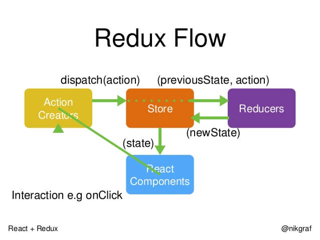

# Redux 学习
- [Redux 学习](#redux-%e5%ad%a6%e4%b9%a0)
  - [声明：](#%e5%a3%b0%e6%98%8e)
  - [参考：](#%e5%8f%82%e8%80%83)
- [基础用法](#%e5%9f%ba%e7%a1%80%e7%94%a8%e6%b3%95)
  - [快速创建一个 Store](#%e5%bf%ab%e9%80%9f%e5%88%9b%e5%bb%ba%e4%b8%80%e4%b8%aa-store)
  - [Action](#action)
    - [Action Creator](#action-creator)
  - [store.dispatch()](#storedispatch)
  - [Reducer](#reducer)
    - [为什么这个函数叫 Reducer 呢？](#%e4%b8%ba%e4%bb%80%e4%b9%88%e8%bf%99%e4%b8%aa%e5%87%bd%e6%95%b0%e5%8f%ab-reducer-%e5%91%a2)
  - [纯函数](#%e7%ba%af%e5%87%bd%e6%95%b0)
  - [store.subscribe()](#storesubscribe)
  - [Store 的实现](#store-%e7%9a%84%e5%ae%9e%e7%8e%b0)
  - [Reducer 的拆分](#reducer-%e7%9a%84%e6%8b%86%e5%88%86)
    - [为什么要拆分](#%e4%b8%ba%e4%bb%80%e4%b9%88%e8%a6%81%e6%8b%86%e5%88%86)
  - [工作流程（总结）](#%e5%b7%a5%e4%bd%9c%e6%b5%81%e7%a8%8b%e6%80%bb%e7%bb%93)
- [高级用法](#%e9%ab%98%e7%ba%a7%e7%94%a8%e6%b3%95)
  - [中间件的概念](#%e4%b8%ad%e9%97%b4%e4%bb%b6%e7%9a%84%e6%a6%82%e5%bf%b5)
  - [中间件的用法](#%e4%b8%ad%e9%97%b4%e4%bb%b6%e7%9a%84%e7%94%a8%e6%b3%95)
  - [applyMiddleware()](#applymiddleware)
  - [异步操作的基本思路](#%e5%bc%82%e6%ad%a5%e6%93%8d%e4%bd%9c%e7%9a%84%e5%9f%ba%e6%9c%ac%e6%80%9d%e8%b7%af)
  - [redux-thunk 中间件](#redux-thunk-%e4%b8%ad%e9%97%b4%e4%bb%b6)
  - [redux-promise 中间件](#redux-promise-%e4%b8%ad%e9%97%b4%e4%bb%b6)

## 声明：
用来确认自己把内容看进脑子的“复印”文章，只有少许理解，还有顺便方便自己复习。如果真有人看请移步下方参考的链接文章中学习。

## 参考：
- [Redux])(https://redux.js.org/)
- [阮一峰Redux入门教程（一）：基本用法](https://www.ruanyifeng.com/blog/2016/09/redux_tutorial_part_one_basic_usages.html)
- [阮一峰Redux入门教程（二）：中间件与异步操作](https://www.ruanyifeng.com/blog/2016/09/redux_tutorial_part_two_async_operations.html)
- [阮一峰Redux入门教程（三）：React-Redux 的用法](https://www.ruanyifeng.com/blog/2016/09/redux_tutorial_part_three_react-redux.html)


# 基础用法
## 快速创建一个 Store
快速创建一个对象（Redux 是单例模式创建的 Store）  
代码：

控制台结果：


- **Redux** 规定， 一个 **State** 对应一个 **View**。只要 **State** 相同，**View** 就相同。你知道 **State**，就知道 **View** 是什么样，反之亦然。
- **State** 的变化，会导致 **View** 的变化。但是，用户接触不到 **State**，只能接触到 **View**。所以，**State** 的变化必须是 **View** 导致的。**Action** 就是 **View** 发出的通知，表示 **State** 应该要发生变化了。

**Action** 是一个对象。其中的 `type` 属性是必须的，表示 **Action** 的名称。
```js
const action = {
  type: 'ADD_TODO',
  payload: 'Learn Redux'
}
```

## Action
**Action** 可以理解为当前发生的事情。改变 **State** 的*唯一*办法。


### Action Creator
**View** 要发送多少种消息，就会有多少种 **Action**。为了方便我们使用 **Action Creator** 函数来生成 **Action**。

```js
const ADD_TODO = '添加 TODO';

function addTodo(text) {
  return {
    type: ADD_TODO,
    text
  }
}

const action = addTodo('Learn Redux');
```
这里的`addTodo`函数就是一个 **Action Creator**

## store.dispatch()
`store.dispatch()` 是 View 发出 Action 的唯一方法。
```js
import { createStore } from 'redux';
const store = createStore(fn);

store,dispatch({
  type: 'ADD_TODO',
  payload: 'Learn Redux'
});
```
> `dispatch`本身是来自**Redux** 的 `createStore()` 所生成的对象中的一个方法，参数就是接收一个 **action**，将它发出去。参数也可以是一个 **Action Creator** 函数，它会返回一个**action**。

## Reducer
**Store** 收到 **Action** 之后，必须给出一个新的 **State**，这样 **View** 才会变化。这种 **State** 的计算过程就叫 **Reducer**。（这也是在 geektime 学习中没有弄清楚的内容）
> Reducer 最后都会返回一个新的`state`，这也是最后用 `getState()`所获取到的值。

```js
const reducer = function (state, action) {
  // ...
  return new_state;
}
```
应用的初始状态（默认呈现的状态），可作为 State 的默认值。
```js
const defaultState = 0;
const reducer = (state = defaultState, action) => {
  switch (action.type) {
    case 'ADD':
      return state + action.payload;
    default:
      return state;
  }
};

const state = reducer(1, {
  type: 'ADD',
  payload: 2
});
```
**Reducer** 收到了一个`type: 'ADD'`的 Action，便在函数中实现了加的处理，state 从而更新了。  
  
实际应用`store.dispatch`方法会触发 **Reducer** 的自动执行，需要将 **Reducer** 传入 `createStore` 方法。
```js
import { createState } from 'redux';
const store = createStore(reducer);
```
这样将**reducer**作为`createStore`函数的参数传入，每当`store.dispatch`发送过来一个新的**Action**，就会自动调用 **Reducer**，得到新的 State。  
  
### 为什么这个函数叫 Reducer 呢？
因为它可以作为数组的 `reduce` 方法的参数(MDN对于 reduce 函数的函数参数就叫 reducer)。[Array.prototype.reduce()](https://developer.mozilla.org/zh-CN/docs/Web/JavaScript/Reference/Global_Objects/Array/Reduce)
```js
const actions = [
  { type: 'ADD', payload: 0 },
  { type: 'ADD', payload: 1 },
  { type: 'ADD', payload: 2 }
];

// reducer 是我们自己的处理函数
const total = actions.reduce(reducer, 0); // 3
```

## 纯函数
**Reducer** 函数最重要的特征是，它是一个纯函数。也就是说，只要是同样的输入，必定得到同样的输出。  
纯函数是函数式变成的概念，必须遵守下一些约束。
- 不得改写参数
- 不能调用系统 I/O 的 API
- 不能调用`Date.now()`或者`Math.rendom()`等不纯的方法，因为**每次会得到不一样的结果**
由于 Reducer 是纯函数，就可以保证同样的 State，必定得到同样的 View。但也正因为这一点，Reducer 函数里面不能改变 State,必须返回一个全新的对象，请参考下面的写法。(每次想要改变的 State，都会产生一个新的 State)  

like this:
```js
// State 是一个对象
function reducer(state, action) {
  return Object.assign({}, state, { thingToChange });
  // 或者
  return { ...state, ...newState };
}

// State 是一个数组
function reducer(state, action) {
  return [...state, newItem];
}
```

## store.subscribe()
使用`store.subscribe()`来设置监听函数，一旦 State 发生变化，就自动执行这个函数(listener)。(一般比如用来监听组件的render函数，如果要实现组件的更新那必须有订阅监听，那这个方法便是`subscribe()`)
```js
import { createStore } from 'redux';
const store = createStore(reducer);

store.subscribe(listener);
```
store.subscribe方法返回一个函数，调用这个函数就可以解除监听。
```js
let unsubscribe = store.subscribe(() =>
  console.log(store.getState())
);

unsubscribe();
```
## Store 的实现
总结上面的内容
```js
import { createStore } from 'redux';
let { subscribe, dispatch, getState } = createStore(reducer);

/**
 * we can use:
 * store.getState()
 * store.dispatch()
 * store.subscribe()
 * /
```
createStore 方法还可以接收第二个参数，第二个参数表示 State 的最初状态，例如数据是从服务器拉取的默认值，那么这样设置就对了。
```js
let store = createStore(todoApp, window.STATE_FROM_SERVER)
```
如果提供了 `window.STATE_FROM_SERVER` ，那么它就是整个应用的初始值，**会覆盖 Reducer 函数的默认值**(本地设置的默认值优先级将会被代替)。  

`createStore`方法的简单实现：
```js
const createStore = (reducer) => {
  let state;
  let listeners = [];

  const getState = () => state;

  const dispatch = (action) => {
    state = reducer(state, action);
    listeners.forEach(listener => listener());
  };

  const subscribe = (listener) => {
    listeners.push(listener);
    return () => {
      listeners = listeners.filter(l => l !== listener);
    }
  };

  dispatch({});

  return { getState, dispatch, subscribe };
};
```
## Reducer 的拆分
### 为什么要拆分
Reducer 函数负责生成(新的) State，由于整个应用只有一个 State 对象，包含所有数据，对于大型应用来说，这个 State 必然十分庞大，导致 Reducer 函数也十分庞大。  
所要用到的方案之前在学习的时候也知道，按照单一的功能进行拆分，不同的函数处理不同的属性，例如本来一个`switch`要`case`一系列毫无关系的`Action`(type)，就可以按照 Action 属性所表示的行为进行函数拆分，不同函数处理不同属性，最终把它们合并成一个大的 Reducer 即可。  


例如：
```js
const chatReducer = (state = defaultState, action = {}) => {
  const { type, payload } = action;
  switch (type) {
    case ADD_CHAT:
      return Object.assign({}, state, {
        chatLog: state.chatLog.concat(payload)
      });
    case CHANGE_STATUS:
      return Object.assign({}, state, {
        statusMessage: payload
      });
    case CHANGE_USERNAME:
      return Object.assign({}, state, {
        userName: payload
      });
    default: return state;
  }
};

// -------- 拆分后再组合成一个Reducer：
const chatReducer = (state = defaultState, action = {}) => {
  return {
    chatLog: chatLog(state.chatLog, action),
    statusMessage: statusMessage(state.statusMessage, action),
    userName: userName(state.userName, action)
  }
};

```
这时候就好理解之前课程中学习到的Redux提供的`combineReducers`方法了，这个方法的作用就是将 Reducer 合并成一个大的函数。
```js
import { combineReducers } from 'redux';

const chatReducer = combineReducers({
  chatLog,
  statusMessage,
  userName
})

// 如果 State 的属性名与 Reducer 不同名，就需要像下面这样：
const reducer = combineReducers({
  a: doSomethingWithA,
  b: processB,
  c: c
})

// 等同于
function reducer(state = {}, action) {
  return {
    a: doSomethingWithA(state.a, action),
    b: processB(state.b, action),
    c: c(state.c, action)
  }
}

export default todoApp;
```
也可以把所有子 Reducer 放在一个文件中，之后统一引入：
```js
import { combineReducers } from 'redux'
import * as reducers from './reducers'

const reducer = combineReducers(reducers)
```

## 工作流程（总结）

- 首先，用户发出 Action。
```js
store.dispatch(action);
```
(比如用户点击了组件（view）上的一个按钮，按钮绑定了`click`事件，事件会触发`dispatch`，`dispatch`的参数是我们之前设定好的`action`，`action`是一个具有标识，并且用`type`属性简单说明的普通对象)

- Store 自动调用 Reducer,并且传入两个参数：当前 State（最初的数据）和收到的 Action（需要改变的数据），Reducer 是个纯函数，不会对传入的参数进行修改，所以会返回一个新的 State。

- State 一旦有变化，Store 就会调用监听函数。
```
// 设置监听函数，例如组件的 render 函数
store.subscribe(listener);
```
- listener 可以通过 `store.getState()` 得到当前状态。如果用的是 React，这时可以触发重新渲染 View。


# 高级用法
之前学习的内容能很容易的实现一个以来 store.subscribe() 函数进行自动渲染的同步组件。  
也就是基本用法：
- 发出 Action
- Reducer 纯函数计算出新的 State
- View 重新渲染
> Action 到 Reduer 之间需要 dispatch 来触发

Action 发出请求后过段时间才执行 Reducer，这种异步操作需要用到新的工具：中间件（middleware）

## 中间件的概念
这一段博客原文说的很好：
（就直接贴了）


## 中间件的用法
在应用中引用中间件，用`applyMiddleware()`（来自redux）方法将引入的中间件传入`createStore()`方法，完成对`store.dispatch()`的功能增强。
```js
import { applyMiddleware, createStore } from 'redux';
import createLogger from 'redux-logger';
const logger = createLogger();

const store = createStore(
  reducer,
  applyMiddleware(logger)
);
```
> 如果应用有初始状态作为参数，那么`applyMiddleware`函数就是第三个参数。另外注意一些中间件也次序。

## applyMiddleware()
书接上文，出现的新的函数，用来加入中间件的操作函数。  
这个函数来自 Redux，作用是将所有中间件组成一个数组，依次执行（这也是为什么有些中间件要按照一定顺序加载的原因)。


## 异步操作的基本思路
**同步操作**只要发出**一种** action 即可，**异步操作**的差别是它要发出**三种** action。
分别是：
- 操作发起时的 Action
- 操作成功时的 Action
- 操作失败时的 Action
以向服务器取出数据为例，三种 Action 可以有两种不同的写法。
```js
// 写法一：名称相同，参数不同
{ type: 'FETCH_POSTS' } // 操作发起的 Action
{ type: 'FETCH_POSTS', status: 'error', error: 'Oops' } // 操作失败的 Action
{ type: 'FETCH_POSTS', status: 'success', response: { ... } } // 操作失败的 Action,也会带上我们需要的响应值(responsej)

// 写法二：名称不同，Action 功能内容和上面顺序一样
{ type: 'FETCH_POSTS_REQUEST' }
{ type: 'FETCH_POSTS_FAILURE', error: 'Oops' }
{ type: 'FETCH_POSTS_SUCCESS', response: { ... } }
```
除了 Action 种类不同，移步操作的 State 也要进行改造，反应不同的操作状态。
```js
let state = {
  // ...
  isFeatching: ture, // 是否在抓取数据
  didInvalidate: ture, // 数据是否过时
  lastUpdated: 'xxxx', // 表示上一次更新时间
}
```
思路是：
- 操作开始时，送出一个 Action, 触发 State 更新为 "正在操作" 状态，View 重新渲染
- 操作结束后，再送出一个 Action,触发 State 更新为 "操作结束" 状态，View 再一次重新渲染


## redux-thunk 中间件
[redux-thunk](https://github.com/reduxjs/redux-thunk)
主要解决异步 Action Creator 因为 `store.dispatch` 无法接收 Action Creator 返回的函数参数，用 `redux-thunk` 中间件，并且在 `createStore` 执行时，用函数中的 `applyMiddleware` 插入中间件，以改造 `store.dispatch`。
```js
import { createStore, appMiddleware } from 'redux';
import thunk from 'redux-thunk';
import reducer from './reducers';

// Note: this API requires redux@>=3.1.0
const store = createStore(
  reducer,
  applyMiddleware(thunk)
);
```

## redux-promise 中间件
和之前的 `redux-thunk` 中间件类似，前者时让 Action Creator 返回一个函数，那这个中间件就是为了让 Action Creator 返回一个 Promise 对象。
```js
import { createStore, applyMiddleware } from 'redux';
import promiseMiddleware from 'redux-promise';
import reducer from './reducers';

const store = createStore(
  reducer,
  applyMiddleware(promiseMiddleware)
); 
```
使用`promiseMiddleware`使得`store.dispatch`方法可以接收 Promise 对象作为参数。
  
这样的 Action Creator 有两种写法：
1. 返回值是一个 Promise 对象
```js
const fetchPosts = 
  (dispatch, postTitle) => new Promise(function (resolve, reject) {
     dispatch(requestPosts(postTitle));
     return fetch(`/some/API/${postTitle}.json`)
       .then(response => {
         type: 'FETCH_POSTS',
         payload: response.json()
       });
});
```
2. Action 对象的 payload 属性是一个 Promise 对象，这需要从`redux-actions`模块中引入`creaetAction`方法，并且写法也要变成下面这样。
```js
import { createAction } from 'redux-actions';

class AsyncApp extends Component {
  componentDidMount() {
    const { dispatch, selectedPost } = this.props
    // 发出同步 Action
    dispatch(requestPosts(selectedPost));
    // 发出异步 Action
    dispatch(createAction(
      'FETCH_POSTS',
      fetch(`/some/API/${postTitle}.json`)
        .then(response => response.json())
    ));
  }
```
第二个 `dispatch` 方法发出的是异步 Action，只有等到操作结束，这个 Action 才会实际发出。注意 `createAction` 的第二个参数必须是一个 Promise 对象（比如这里的 `fetch()`方法）。  
更详细的内容参考[源码](https://github.com/acdlite/redux-promise/blob/master/src/index.js)

